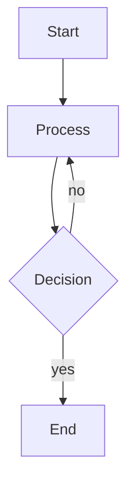

## Context

Trellis is a Mermaid diagram renderer that uses A\* maze routing on a grid.
Its quality knobs live in two places:

| Location | Field | Effect |
|---|---|---|
| `TrellisConfig` (`trellis-core/src/config.rs`) | `routing_costs.bend_cost` | Penalty per bend in A\* path cost |
| `TrellisConfig` | `routing_costs.crossing_cost` | Penalty for crossing an occupied cell |
| `TrellisConfig` | `port_assignment` | Strategy: `Default` / `Barycenter` / `Median` / `CrossingGreedy` |
| `TrellisConfig` | `cell_size` | Grid resolution (larger = more routing room) |
| Iterative port refinement (`ports/iterative.rs`) | `max_rounds` | Number of crossing-reduction rounds |

Quality flags emitted by `trellis-validate`:

| Flag | Meaning |
|---|---|
| `high_detour` | Routed path is ≥ 2× the Manhattan distance |
| `excessive_bends` | Path has ≥ 4 direction changes |
| `avoidable_crossing` | Edge crosses another edge's cell |

---

## Inputs to provide to the AI agent

### 1 — Diagram source (`.mmd`)



### 2 — Current `TrellisConfig` (TOML)

```toml
cell_size        = 10
corner_radius    = 8.0
show_edge_labels = true
render_crossings = false
port_assignment  = "Default"

[routing_costs]
bend_cost     = 2.0
crossing_cost = 10.0
```

### 3 — Quality report (`{fixture}.json`)

Produced by `trellis evaluate <fixture>.mmd -o ./reports/`.

```json
{
  "fixture": "b05.mmd",
  "edges": [
    {
      "id": "A-->B",
      "source": "A",
      "target": "B",
      "bends": 4,
      "detour_factor": 2.3,
      "crossings": 1,
      "port_side_source": "South",
      "port_side_target": "North",
      "path_cells": [[3,4],[3,5],[4,5],[5,5],[5,6]],
      "quality_score": 0.42,
      "flags": ["high_detour", "avoidable_crossing"]
    }
  ],
  "global_metrics": {
    "total_edges": 4,
    "routed_edges": 4,
    "failed_edges": 0,
    "total_crossings": 1,
    "total_bends": 9,
    "avg_quality_score": 0.61,
    "avg_detour_factor": 1.8,
    "flagged_edges": 2
  }
}
```

### 4 — Human feedback (`feedback.json`)

Produced by `trellis generate-review ./reports/` → open `review.html` in a browser
→ annotate edges → click **Download feedback.json**.

```json
{
  "b05.mmd": {
    "edges": {
      "A-->B": {
        "improvable": true,
        "note": "unnecessary detour around D; should go straight south"
      },
      "C-->E": {
        "improvable": true,
        "note": "could use south port instead of east to avoid crossing B-->D"
      }
    }
  }
}
```

### 5 - Strategy selection guide

When `--compare-strategies` shows one port-assignment strategy consistently
wins for a given graph topology, lock it in via `port_assignment` in config:

| Topology | Recommended strategy |
|---|---|
| Dense fan-out from one node | `CrossingGreedy` |
| Bipartite / layered graphs  | `Barycenter` |
| Sparse / few crossings      | `Default` |
| Long chains with outliers   | `Median` |

For mixed topologies, `Barycenter` is the safe default.

---

## Instructions

You are a routing algorithm tuning assistant for Trellis, a Mermaid diagram
renderer that uses A* maze routing on a grid.

## Diagram source

The fixture mermaid files are in folder `tests\benchmarks\fixtures`

## Current TrellisConfig (TOML)

Currently the default configurations are used. No external config file used.

## Quality report

The AI Assistant can read all quality reports in folder `temp\trellis-batch`.
The file name pattern is `{fixture-name}_{port-assignment-algorithm}.json`

## Human feedback

The exported humen feedback file is `temp\result\feedback.json`

## Your task

1. Load the feedback file
2. Find the impacted fixtures and the generated SVG file(s). Name pattern is `{fixture-name}_{port_assignment}_annotated.svg`
3. Find the mentioned edges. Check them to focus on:
    * routing
    * port assignments (ehich strategy would be better?)
4. Suggest me algorithic and/or configuration changes to achieve the expected edge paths.

