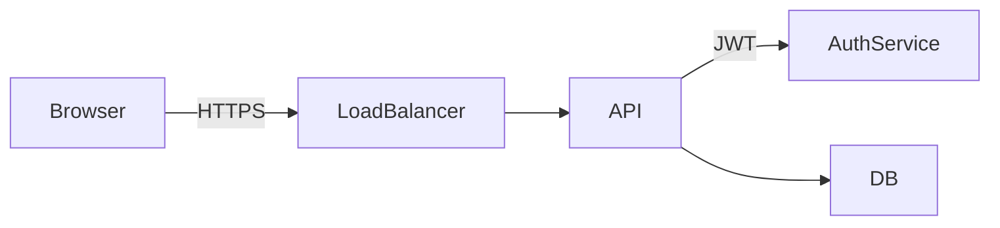

# Pandoc Integration

The Trellis Pandoc Docker image renders Markdown documents with embedded Mermaid diagrams directly to PDF or HTML. No pre-processing step, no local Trellis install, no separate diagram export. Write Mermaid in your Markdown, get clean diagrams in your output.

Designed for teams that write documentation in Markdown and need diagrams that ship with the document.

---

## Prerequisites

Docker. That's it.

---

## Usage

### Pull the image

```bash
docker pull ghcr.io/trellis-lab/trellis-pandoc:latest
```

### Render to PDF

```bash
docker run --rm -v "$(pwd):/data" ghcr.io/trellis-lab/trellis-pandoc:latest document.md -o document.pdf
```

### Render to HTML

```bash
docker run --rm -v "$(pwd):/data" ghcr.io/trellis-lab/trellis-pandoc:latest document.md -o document.html
```

The `-v "$(pwd):/data"` flag mounts your current directory into the container. Both the input file and the output file are resolved relative to that directory.

---

## Example Markdown

````markdown
# System Design

Here is the authentication flow:



The diagram above is rendered automatically.
````

Save this as `document.md` and run:

```bash
docker run --rm -v "$(pwd):/data" ghcr.io/trellis-lab/trellis-pandoc:latest document.md -o document.pdf
```

The `mermaid` code blocks become embedded SVG in the output. No external references, no network calls at render time.

---

## Advanced: Lua filter directly

If you have Pandoc and the `trellis` binary installed locally, you can run the filter without Docker:

```bash
pandoc --lua-filter=filters/trellis-filter.lua document.md -o document.pdf
```

Requirements:
- Pandoc installed locally
- `trellis` binary in your `PATH`
- `filters/trellis-filter.lua` from this repository

The Docker image is recommended for reproducible builds and CI environments.

---

## Output note

All `mermaid` code blocks are converted to embedded SVG in the output document. The diagrams are self-contained — no external images, no CDN references. PDF output embeds the SVG directly into the PDF pages. HTML output inlines the SVG into the HTML file.
