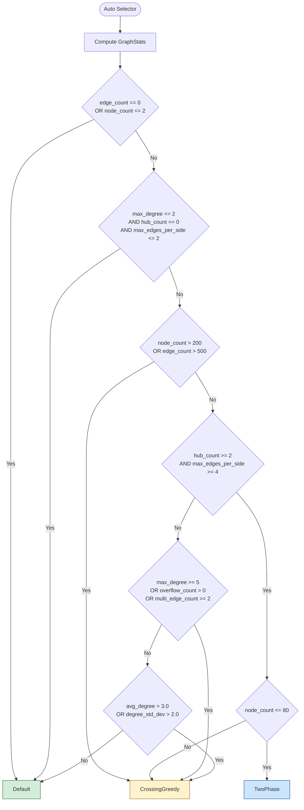
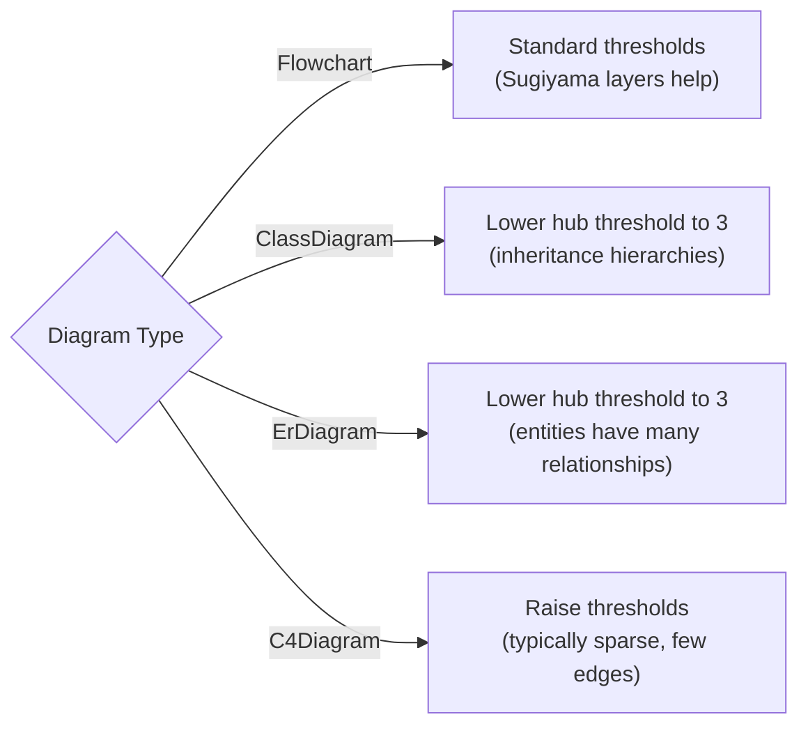
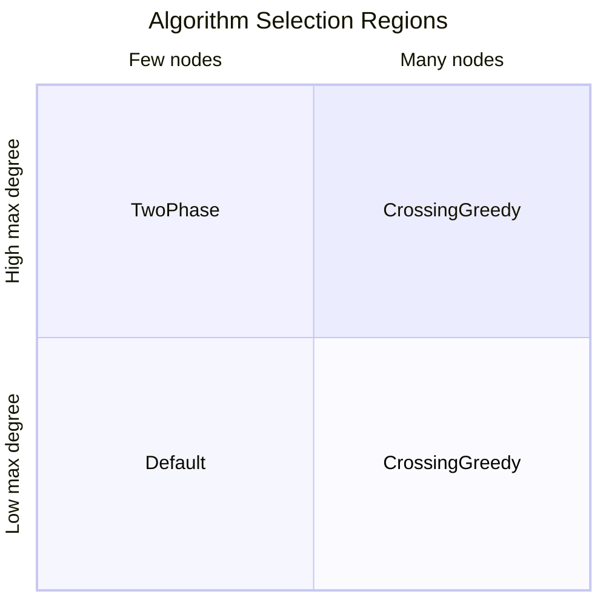
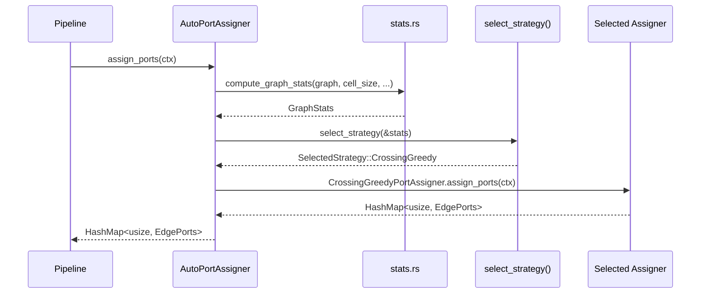
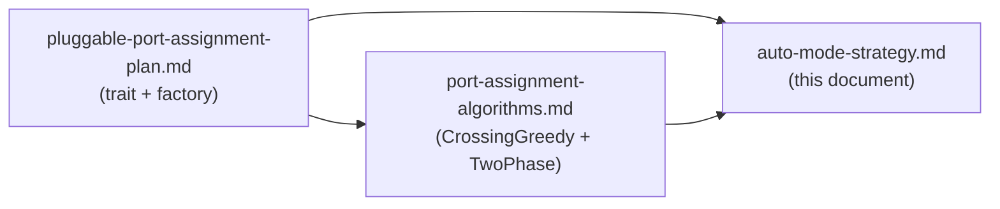

# Auto Mode — Adaptive Port Assignment Strategy

## Overview

The `Auto` strategy analyses structural and spatial properties of the placed graph and
selects the most appropriate port assignment algorithm. It runs after placement (when node
positions and dimensions are known) but before port assignment and routing.

The goal is to use the cheapest algorithm that produces good results for the given graph,
avoiding expensive multi-round strategies on simple diagrams while engaging them automatically
when the graph topology warrants it.

---

## Graph Statistics

### Data Model

```rust
/// Structural and spatial statistics of a placed graph.
/// Computed once, O(N + E), used by the Auto selector to pick a strategy.
pub struct GraphStats {
    // ── Size ──────────────────────────────────────────────────
    pub node_count: usize,
    pub edge_count: usize,
    pub subgraph_count: usize,
    pub diagram_type: DiagramType,

    // ── Degree distribution ───────────────────────────────────
    pub max_degree: usize,
    pub avg_degree: f64,
    pub degree_std_dev: f64,
    pub hub_count: usize,               // nodes with degree >= HUB_THRESHOLD (4)

    // ── Side congestion ───────────────────────────────────────
    pub max_edges_per_side: usize,      // across all nodes, all sides
    pub overflow_count: usize,          // edges moved during overflow handling
    pub avg_connectors_per_side: f64,   // available connectors / occupied sides

    // ── Edge patterns ─────────────────────────────────────────
    pub multi_edge_count: usize,        // pairs with 2+ edges between them
    pub bidirectional_edge_count: usize,// A→B and B→A both exist
    pub avg_edge_node_ratio: f64,       // edge_count / node_count
    pub median_edge_node_ratio: f64,    // median of per-node edge counts / 1

    // ── Spatial ───────────────────────────────────────────────
    pub max_node_distance: f64,         // furthest pair of connected nodes
    pub layout_density: f64,            // bounding_box_area / node_count
    pub min_connectors_on_loaded_side: usize, // tightest bottleneck
}
```

### Computation

All statistics are derived from the placed `Graph` in a single pass. No routing is needed.

```
Location: crates/trellis-core/src/ports/stats.rs (new file)
Entry:    pub fn compute_graph_stats(graph: &Graph, cell_size: i32, offset_x: i32, offset_y: i32) -> GraphStats
```

#### Stat Categories and How They Are Computed

**Size metrics** — trivially read from `graph.nodes.len()`, `graph.edges.len()`,
`graph.subgraphs.len()`, `graph.diagram_type`.

**Degree distribution** — build a `HashMap<node_id, degree>` by iterating edges.
Derive max, mean, standard deviation, and count nodes exceeding the hub threshold.

```rust
let mut degrees: HashMap<&str, usize> = HashMap::new();
for edge in &graph.edges {
    *degrees.entry(edge.from.as_str()).or_default() += 1;
    *degrees.entry(edge.to.as_str()).or_default() += 1;
}
let max_degree = degrees.values().copied().max().unwrap_or(0);
let avg_degree = degrees.values().sum::<usize>() as f64 / degrees.len().max(1) as f64;
let hub_count = degrees.values().filter(|&&d| d >= HUB_THRESHOLD).count();
```

**Side congestion** — for each node, compute the angle to each connected node, map to side,
count edges per side, and track the max. This reuses `angle_to_side()` and
`enumerate_connectors()` from `ports/common.rs`.

```rust
for node in &graph.nodes {
    for side in [Top, Right, Bottom, Left] {
        let edge_count_on_side = count_edges_on_side(node, side, graph);
        let connectors = enumerate_connectors(node, side, cell_size, offset_x, offset_y).len();
        max_edges_per_side = max_edges_per_side.max(edge_count_on_side);
        if edge_count_on_side > connectors {
            overflow_count += edge_count_on_side - connectors;
        }
    }
}
```

**Edge patterns** — iterate edges once, collecting `(from, to)` pairs in a `HashSet` to
detect multi-edges and bidirectional pairs.

**Spatial metrics** — iterate connected node pairs for max distance. Bounding box from
min/max of `(node.x, node.y, node.x + node.width, node.y + node.height)`.

---

## Decision Logic

### Flow



### Decision Table

| Condition | Selected Strategy | Rationale |
|---|---|---|
| No edges or <= 2 nodes | `Default` | Nothing to optimise |
| max_degree <= 2, no hubs, max_edges_per_side <= 2 | `Default` | Linear/chain graph — no crossing risk |
| node_count > 200 OR edge_count > 500 | `CrossingGreedy` | Large graph — multi-round is too expensive |
| hub_count >= 2 AND max_edges_per_side >= 4 AND node_count <= 80 | `TwoPhase` | Complex topology, manageable size — worth the routing feedback |
| hub_count >= 2 AND max_edges_per_side >= 4 AND node_count > 80 | `CrossingGreedy` | Complex but too large for multi-round |
| max_degree >= 5 OR overflow > 0 OR multi_edges >= 2 | `CrossingGreedy` | Moderate complexity — inversion sorting helps |
| avg_degree > 3.0 OR degree_std_dev > 2.0 | `CrossingGreedy` | Dense or skewed degree distribution |
| Everything else | `Default` | Simple enough for angle-based assignment |

### Diagram Type Adjustments

Certain diagram types have structural tendencies that shift the thresholds:



```rust
let hub_threshold = match stats.diagram_type {
    DiagramType::ClassDiagram | DiagramType::ErDiagram => 3,
    DiagramType::C4Diagram => 6,
    _ => 4, // Flowchart default
};
```

---

## Implementation

### New Files

```
crates/trellis-core/src/ports/
    stats.rs     — GraphStats struct + compute_graph_stats()
    auto.rs      — AutoPortAssigner implementing PortAssigner
```

### `stats.rs` — Graph Statistics

```rust
use std::collections::{HashMap, HashSet};
use trellis_parser::{DiagramType, Graph};
use super::common::{angle_to_side, enumerate_connectors};
use super::Side;

const HUB_THRESHOLD_DEFAULT: usize = 4;

pub struct GraphStats {
    pub node_count: usize,
    pub edge_count: usize,
    pub subgraph_count: usize,
    pub diagram_type: DiagramType,

    pub max_degree: usize,
    pub avg_degree: f64,
    pub degree_std_dev: f64,
    pub hub_count: usize,

    pub max_edges_per_side: usize,
    pub overflow_count: usize,
    pub avg_connectors_per_side: f64,

    pub multi_edge_count: usize,
    pub bidirectional_edge_count: usize,
    pub avg_edge_node_ratio: f64,
    pub median_edge_node_ratio: f64,

    pub max_node_distance: f64,
    pub layout_density: f64,
    pub min_connectors_on_loaded_side: usize,
}

pub fn compute_graph_stats(
    graph: &Graph,
    cell_size: i32,
    offset_x: i32,
    offset_y: i32,
) -> GraphStats {
    // ... single-pass computation over nodes and edges
    // See "Computation" section above for per-field logic
}
```

### `auto.rs` — Auto Selector

```rust
use super::{PortAssigner, PortAssignmentContext};
use super::stats::{compute_graph_stats, GraphStats};
use super::assignment::DefaultPortAssigner;
use super::crossing_greedy::CrossingGreedyPortAssigner;
use super::two_phase::TwoPhasePortAssigner;
use std::collections::HashMap;
use crate::ports::EdgePorts;
use trellis_parser::DiagramType;

pub struct AutoPortAssigner;

impl PortAssigner for AutoPortAssigner {
    fn assign_ports(&self, ctx: &PortAssignmentContext) -> HashMap<usize, EdgePorts> {
        let stats = compute_graph_stats(ctx.graph, ctx.cell_size, ctx.offset_x, ctx.offset_y);
        let selected = select_strategy(&stats);

        match selected {
            SelectedStrategy::Default => DefaultPortAssigner.assign_ports(ctx),
            SelectedStrategy::CrossingGreedy => CrossingGreedyPortAssigner.assign_ports(ctx),
            SelectedStrategy::TwoPhase => TwoPhasePortAssigner.assign_ports(ctx),
        }
    }
}

enum SelectedStrategy {
    Default,
    CrossingGreedy,
    TwoPhase,
}

fn select_strategy(stats: &GraphStats) -> SelectedStrategy {
    // Trivial graphs
    if stats.edge_count == 0 || stats.node_count <= 2 {
        return SelectedStrategy::Default;
    }

    // Simple chain/linear graphs
    if stats.max_degree <= 2 && stats.hub_count == 0 && stats.max_edges_per_side <= 2 {
        return SelectedStrategy::Default;
    }

    // Large graphs — avoid multi-round
    if stats.node_count > 200 || stats.edge_count > 500 {
        return SelectedStrategy::CrossingGreedy;
    }

    // Diagram-type-adjusted hub threshold
    let hub_threshold = match stats.diagram_type {
        DiagramType::ClassDiagram | DiagramType::ErDiagram => 3,
        DiagramType::C4Diagram => 6,
        _ => 4,
    };
    let effective_hub_count = count_hubs_with_threshold(stats, hub_threshold);

    // Complex topology at manageable scale
    if effective_hub_count >= 2 && stats.max_edges_per_side >= 4 {
        if stats.node_count <= 80 {
            return SelectedStrategy::TwoPhase;
        }
        return SelectedStrategy::CrossingGreedy;
    }

    // Moderate complexity indicators
    if stats.max_degree >= 5
        || stats.overflow_count > 0
        || stats.multi_edge_count >= 2
    {
        return SelectedStrategy::CrossingGreedy;
    }

    // Dense or skewed degree distribution
    if stats.avg_degree > 3.0 || stats.degree_std_dev > 2.0 {
        return SelectedStrategy::CrossingGreedy;
    }

    SelectedStrategy::Default
}
```

### Config Integration

Add `Auto` to the `PortAssignmentStrategy` enum:

```rust
#[derive(Debug, Clone, Copy, Serialize, Deserialize, Default)]
pub enum PortAssignmentStrategy {
    #[default]
    Default,
    Barycenter,
    Median,
    CrossingGreedy,
    IterativeSwap,
    Annealing,
    TwoPhase,
    Auto,           // <-- new variant
}
```

Update the factory in `ports/mod.rs`:

```rust
pub fn create_port_assigner(strategy: PortAssignmentStrategy) -> Box<dyn PortAssigner> {
    match strategy {
        PortAssignmentStrategy::Default => Box::new(DefaultPortAssigner),
        PortAssignmentStrategy::CrossingGreedy => Box::new(CrossingGreedyPortAssigner),
        PortAssignmentStrategy::TwoPhase => Box::new(TwoPhasePortAssigner),
        PortAssignmentStrategy::Auto => Box::new(AutoPortAssigner),
        // ...other variants
    }
}
```

TOML usage:

```toml
port_assignment = "Auto"
```

### Module Structure Update

```
crates/trellis-core/src/ports/
    mod.rs              — trait, context, factory, exports
    common.rs           — shared helpers (enumerate_connectors, angle_to_side, etc.)
    assignment.rs       — DefaultPortAssigner (existing, renamed internals)
    crossing_greedy.rs  — CrossingGreedyPortAssigner
    two_phase.rs        — TwoPhasePortAssigner
    stats.rs            — GraphStats + compute_graph_stats()
    auto.rs             — AutoPortAssigner + select_strategy()
```

---

## Decision Boundary Visualisation

The selector divides the (node_count, max_degree) space into three regions. The boundaries
shift based on secondary metrics (hub_count, overflow, multi-edges).



Conceptual mapping:
- **Bottom-left** (few nodes, low degree): `Default` — no crossing risk
- **Top-left** (few nodes, high degree): `TwoPhase` — complex but small enough for multi-round
- **Bottom-right** (many nodes, low degree): `Default` or `CrossingGreedy` depending on density
- **Top-right** (many nodes, high degree): `CrossingGreedy` — multi-round too expensive

---

## Threshold Tuning

The numeric thresholds in the decision tree are initial estimates. They should be calibrated
against the benchmark fixtures (B01-B12) and additional test graphs.

### Tuning Methodology

1. Run all B01-B12 benchmarks with each strategy (Default, CrossingGreedy, TwoPhase)
2. Record crossing count and render time for each
3. For each fixture, determine which strategy gives the best crossing/time trade-off
4. Compute GraphStats for each fixture
5. Fit the decision thresholds so that `select_strategy()` picks the empirically best one

### Threshold Constants

Extract all magic numbers into named constants for easy adjustment:

```rust
// crates/trellis-core/src/ports/auto.rs

/// Nodes with degree >= this are considered hubs
const HUB_THRESHOLD_FLOWCHART: usize = 4;
const HUB_THRESHOLD_CLASS_ER: usize = 3;
const HUB_THRESHOLD_C4: usize = 6;

/// Graph size limits for multi-round strategies
const MAX_NODES_FOR_TWOPHASE: usize = 80;
const LARGE_GRAPH_NODE_LIMIT: usize = 200;
const LARGE_GRAPH_EDGE_LIMIT: usize = 500;

/// Side congestion thresholds
const SIDE_CONGESTION_THRESHOLD: usize = 4;

/// Degree distribution thresholds
const HIGH_DEGREE_THRESHOLD: usize = 5;
const HIGH_AVG_DEGREE: f64 = 3.0;
const HIGH_DEGREE_STD_DEV: f64 = 2.0;

/// Multi-edge threshold
const MULTI_EDGE_CONCERN: usize = 2;
```

---

## Logging and Observability

When `Auto` selects a strategy, it should log the decision for debugging and tuning:

```rust
#[cfg(not(target_arch = "wasm32"))]
fn log_selection(stats: &GraphStats, selected: &SelectedStrategy) {
    eprintln!(
        "[trellis::auto] nodes={} edges={} max_deg={} hubs={} max_side={} overflow={} → {:?}",
        stats.node_count,
        stats.edge_count,
        stats.max_degree,
        stats.hub_count,
        stats.max_edges_per_side,
        stats.overflow_count,
        selected,
    );
}
```

This output can be captured during benchmark runs to verify threshold correctness.

For the pipeline metrics (`RenderResult`), add the selected strategy name so callers (CLI,
WASM, benchmarks) can see which algorithm was actually used:

```rust
pub struct RenderMetrics {
    // ... existing fields ...
    pub port_assignment_strategy: String,  // "Default", "CrossingGreedy", etc.
}
```

---

## Testing

### Unit Tests for `select_strategy()`

Test each decision path with synthetic `GraphStats` values:

```rust
#[cfg(test)]
mod tests {
    use super::*;

    fn base_stats() -> GraphStats {
        GraphStats {
            node_count: 10,
            edge_count: 12,
            max_degree: 3,
            avg_degree: 2.4,
            degree_std_dev: 0.8,
            hub_count: 0,
            max_edges_per_side: 2,
            overflow_count: 0,
            multi_edge_count: 0,
            bidirectional_edge_count: 0,
            avg_edge_node_ratio: 1.2,
            median_edge_node_ratio: 1.0,
            max_node_distance: 200.0,
            layout_density: 500.0,
            min_connectors_on_loaded_side: 3,
            subgraph_count: 0,
            diagram_type: DiagramType::Flowchart,
        }
    }

    #[test]
    fn trivial_graph_uses_default() {
        let stats = GraphStats { edge_count: 0, ..base_stats() };
        assert!(matches!(select_strategy(&stats), SelectedStrategy::Default));
    }

    #[test]
    fn simple_chain_uses_default() {
        let stats = GraphStats {
            max_degree: 2, hub_count: 0, max_edges_per_side: 1,
            ..base_stats()
        };
        assert!(matches!(select_strategy(&stats), SelectedStrategy::Default));
    }

    #[test]
    fn large_graph_uses_greedy() {
        let stats = GraphStats { node_count: 300, edge_count: 600, ..base_stats() };
        assert!(matches!(select_strategy(&stats), SelectedStrategy::CrossingGreedy));
    }

    #[test]
    fn complex_small_graph_uses_twophase() {
        let stats = GraphStats {
            node_count: 40, hub_count: 3, max_edges_per_side: 5,
            max_degree: 6, ..base_stats()
        };
        assert!(matches!(select_strategy(&stats), SelectedStrategy::TwoPhase));
    }

    #[test]
    fn complex_large_graph_uses_greedy() {
        let stats = GraphStats {
            node_count: 120, hub_count: 3, max_edges_per_side: 5,
            max_degree: 6, ..base_stats()
        };
        assert!(matches!(select_strategy(&stats), SelectedStrategy::CrossingGreedy));
    }

    #[test]
    fn high_degree_uses_greedy() {
        let stats = GraphStats { max_degree: 7, ..base_stats() };
        assert!(matches!(select_strategy(&stats), SelectedStrategy::CrossingGreedy));
    }

    #[test]
    fn overflow_uses_greedy() {
        let stats = GraphStats { overflow_count: 3, ..base_stats() };
        assert!(matches!(select_strategy(&stats), SelectedStrategy::CrossingGreedy));
    }

    #[test]
    fn dense_graph_uses_greedy() {
        let stats = GraphStats { avg_degree: 4.5, ..base_stats() };
        assert!(matches!(select_strategy(&stats), SelectedStrategy::CrossingGreedy));
    }

    #[test]
    fn er_diagram_lower_hub_threshold() {
        // With flowchart threshold (4), hub_count would be 0 → Default
        // With ER threshold (3), these nodes count as hubs → should escalate
        let stats = GraphStats {
            diagram_type: DiagramType::ErDiagram,
            node_count: 30,
            max_degree: 4,
            hub_count: 3, // nodes with degree >= 3
            max_edges_per_side: 4,
            ..base_stats()
        };
        assert!(matches!(select_strategy(&stats), SelectedStrategy::TwoPhase));
    }
}
```

### Integration Tests

For each B01-B12 benchmark fixture, verify that `Auto` selects a strategy and produces
`crossings <= Default`:

```rust
#[test]
fn auto_never_worse_than_default_on_benchmarks() {
    for fixture in ["b01", "b02", ..., "b12"] {
        let graph = parse_fixture(fixture);
        let config_default = TrellisConfig { port_assignment: Default, ..default() };
        let config_auto = TrellisConfig { port_assignment: Auto, ..default() };

        let result_default = render(&graph, &config_default, Svg).unwrap();
        let result_auto = render(&graph, &config_auto, Svg).unwrap();

        assert!(
            result_auto.metrics.crossings <= result_default.metrics.crossings,
            "{}: auto ({}) should not produce more crossings than default ({})",
            fixture, result_auto.metrics.crossings, result_default.metrics.crossings,
        );
    }
}
```

---

## Data Flow



---

## Implementation Order

### Phase 1: Statistics (prerequisite)

1. Extract shared helpers to `ports/common.rs` (from `assignment.rs`)
2. Implement `stats.rs` with `GraphStats` and `compute_graph_stats()`
3. Unit tests for statistics computation against known fixture graphs

### Phase 2: Auto Selector

4. Implement `auto.rs` with `AutoPortAssigner` and `select_strategy()`
5. Add `Auto` variant to `PortAssignmentStrategy` enum
6. Wire into factory in `ports/mod.rs`
7. Unit tests for all decision paths

### Phase 3: Calibration

8. Run B01-B12 with all strategies, collect crossing counts and times
9. Adjust thresholds based on empirical data
10. Add integration test asserting `Auto >= Default` on all fixtures

### Dependencies



`Auto` depends on the pluggable architecture being in place and at least `CrossingGreedy`
being implemented. `TwoPhase` support is optional — `Auto` gracefully falls back to
`CrossingGreedy` if `TwoPhase` is not yet available.
