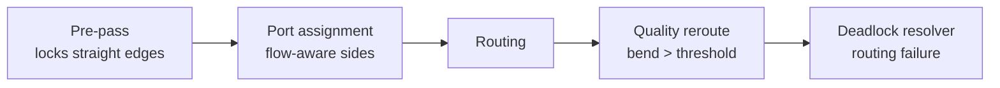
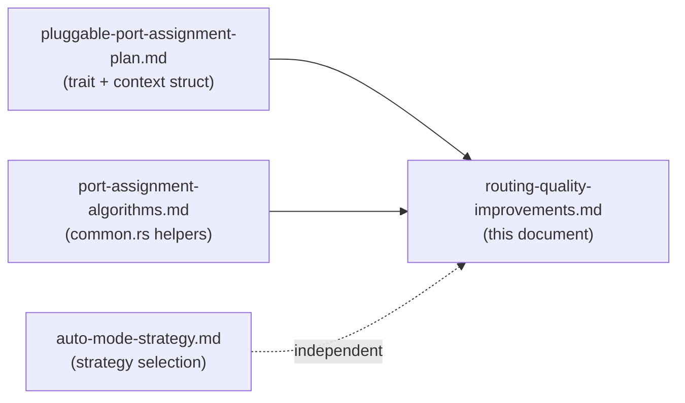

# Routing Quality Improvements

## Overview

Three targeted improvements address systematic routing quality issues identified in
benchmark analysis (b02, b08, b13, b15–b28). They are orthogonal to strategy selection
(see `auto-mode-strategy.md`) and apply on top of any `PortAssignmentStrategy`.

| Improvement | Phase | Fixes |
|---|---|---|
| **Straight-edge pre-pass** | Before port assignment | Unnecessary bends when nodes are already aligned |
| **Flow-aware side selection** | Inside port assignment | E/W ports assigned to edges that naturally flow N/S |
| **Quality-driven rip-up** | After routing | Excessive bends caused by routing congestion, not port choice |

---

## Improvement 1: Straight-Edge Pre-Pass

### Problem

Port assignment algorithms compute ordering within a side. They do not ask:
*"Is there a clear vertical or horizontal corridor between these two nodes?"*

When source and target bounding boxes overlap along one axis, a 0-bend path is geometrically
possible. If the port assigner assigns a port offset from that axis (even by one cell), the
router adds unnecessary bends to converge to a routable lane.

**Evidence from benchmarks:**

| Fixture | Edge | Current bends | Expected |
|---|---|---|---|
| b25 | Hub2→Hub3 | 2 (Barycenter/Median/CG) | 0 (achieved by Default) |
| b25 | Hub3→C1 | 2 | 0 |
| b25 | B3→C2 | 2 | 0 |
| b17 | web_app→spa | 2 | 0 |
| b19 | api→db | 2 | 0 |
| b13 | B→C, C→D | 2 | 0 |

### When is a straight path possible?

A **vertical straight** path exists when:
- Source node's X-span `[src.x, src.x + src.width]` overlaps target's X-span by at least one cell
- No other **node** (not edge — edges are not yet routed) occupies any grid cell in the column
  between the source's South edge and the target's North edge (for a top-down edge)

A **horizontal straight** path exists symmetrically when Y-spans overlap and the row is clear.

At pre-pass time, only node footprints are in the grid. This makes obstacle detection cheap
and exact.

### Algorithm

```
fn straight_edge_prepass(
    graph: &Graph,
    grid: &Grid,            // node footprints committed; no edges yet
    cell_size: i32,
    offset_x: i32,
    offset_y: i32,
) -> HashMap<usize, PinnedPorts>

for each edge E at index i:
    src = graph.nodes[E.source]
    tgt = graph.nodes[E.target]

    // Check vertical alignment
    x_overlap = overlap_range(src.x_span_in_cells(), tgt.x_span_in_cells())
    if x_overlap is non-empty:
        // Find the column within overlap that gives longest unobstructed corridor
        best_col = max over x_overlap of: unobstructed_vertical_length(col, src_bottom_row, tgt_top_row, grid)
        if best_col exists and corridor_length >= required_distance:
            src_port = Port { side: South, col: best_col, row: src.bottom_row }
            tgt_port = Port { side: North, col: best_col, row: tgt.top_row  }
            candidates.push(Candidate { edge_idx: i, src_port, tgt_port, overlap_fraction, direction: Vertical })

    // Check horizontal alignment (symmetric)
    y_overlap = overlap_range(src.y_span_in_cells(), tgt.y_span_in_cells())
    if y_overlap is non-empty AND edge goes left or right:
        ... (symmetric to vertical case)

// Resolve port contention: two edges may compete for the same port slot on a node
// Priority: larger overlap_fraction wins; the other shifts ±1 cell along the same side
candidates.sort_by(|a, b| b.overlap_fraction.partial_cmp(&a.overlap_fraction))

pinned: HashMap<usize, PinnedPorts> = HashMap::new()
used_ports: HashMap<(NodeId, Side, CellCoord), usize> = HashMap::new()   // slot → edge_idx

for candidate in candidates:
    src_slot = (candidate.src_node, South, candidate.src_port.col)
    tgt_slot = (candidate.tgt_node, North, candidate.tgt_port.col)
    if src_slot not in used_ports AND tgt_slot not in used_ports:
        pinned.insert(candidate.edge_idx, PinnedPorts { src: candidate.src_port, tgt: candidate.tgt_port })
        used_ports.insert(src_slot, candidate.edge_idx)
        used_ports.insert(tgt_slot, candidate.edge_idx)
    else:
        // Try ±1 cell shift along the side within the overlap range
        // If a free adjacent slot exists, use it; otherwise skip (let main assigner handle it)
        for delta in [1, -1, 2, -2]:
            shifted = candidate with col adjusted by delta
            if shifted.col still within x_overlap AND slots free:
                pinned.insert(shifted)
                break

return pinned
```

### Data Types

```rust
/// A port assignment locked in before the main assigner runs.
pub struct PinnedPorts {
    pub source: Port,
    pub target: Port,
}

/// Pre-pass result: edges with locked straight-line ports.
/// Passed to the main PortAssigner via PortAssignmentContext.
pub type PinnedPortMap = HashMap<usize, PinnedPorts>;
```

### Integration with `PortAssignmentContext`

```rust
pub struct PortAssignmentContext<'a> {
    pub graph: &'a Graph,
    pub cell_size: i32,
    pub offset_x: i32,
    pub offset_y: i32,
    pub grid: &'a Grid,             // <-- new field (needed for obstacle detection)
    pub pinned_ports: PinnedPortMap, // <-- new field (pre-pass output)
}
```

Each `PortAssigner::assign_ports()` implementation must skip edges present in `pinned_ports`
and emit the pinned values directly:

```rust
// In each assigner's assign_ports():
for (edge_idx, edge) in graph.edges.iter().enumerate() {
    if let Some(pinned) = ctx.pinned_ports.get(&edge_idx) {
        result.insert(edge_idx, EdgePorts {
            source_port: pinned.source.clone(),
            target_port: pinned.target.clone(),
        });
        continue;
    }
    // ... normal assignment logic
}
```

### Pipeline Integration

```rust
// pipeline.rs — Phase 3: Port assignment

let grid = build_grid(&graph, cell_size, &extent); // node footprints only at this point

let pinned = straight_edge_prepass(&graph, &grid, cell_size, extent.offset_x, extent.offset_y);

let assigner = create_port_assigner(config.port_assignment);
let port_ctx = PortAssignmentContext {
    graph: &graph,
    cell_size,
    offset_x: extent.offset_x,
    offset_y: extent.offset_y,
    grid: &grid,
    pinned_ports: pinned,
};
let port_assignments = assigner.assign_ports(&port_ctx);
```

Note: the grid is already built before routing. Passing it to the port context adds no cost.

### New Files

```
crates/trellis-core/src/ports/
    prepass.rs   — straight_edge_prepass(), PinnedPorts, PinnedPortMap
```

### Expected Impact

The pre-pass only fires when nodes are geometrically aligned — a condition that the Sugiyama
placer tends to produce for directly-connected chain nodes. It has zero effect on fixtures
where placement is the root problem (b02, b22, b23, b24). For chain-heavy and hierarchical
graphs it eliminates 0–4 bends per qualifying edge at no routing cost.

---

## Improvement 2: Flow-Aware Port Side Selection

### Problem

The current `angle_to_side()` function maps the geometric angle between two node centres to
one of four sides using equal 90-degree quadrants. This is correct when nodes can be reached
from any direction. In practice, layered (Sugiyama) graphs flow primarily top-to-bottom (TB)
or left-to-right (LR), so most edges should exit South and enter North.

When the horizontal displacement between connected nodes is non-trivial, the angle falls near
a quadrant boundary and the East or West side is selected. The router then has to make a
U-turn from the lateral port back toward the correct vertical channel, adding 2 bends.

**Evidence from benchmarks:**

| Fixture | Edge | Actual sides | Should be |
|---|---|---|---|
| b08 | A→B, D→E | East→West | South→North |
| b22 | Hub→F | East→West | South→North |
| b27 | Router→S5 | East→West | South→North |
| b13 | D→B (back-edge) | North→South forced | correct |
| b18 | internet_banking→mainframe | East→West | South→South (per feedback) |
| b15 | Animal→Cat, Animal→Bird | East→West | South→North |

### Algorithm

Replace the uniform 90-degree quadrants with a **direction-biased sector**:

```
fn angle_to_side_flow_aware(angle_deg: f64, layout_dir: LayoutDirection) -> Side

For LayoutDirection::TopBottom:
    // Prefer South exits and North entries — widen vertical sector
    //
    //   North: 315°..360° ∪ 0°..45°  (45° arc, unchanged)
    //   South: 135°..225°             (90° arc, unchanged — dominant direction)
    //   East:  45°..112.5°            (67.5° arc, narrowed from 90°)
    //   West:  247.5°..315°           (67.5° arc, narrowed from 90°)
    //
    // The 22.5° reduction on each lateral side transfers to South via overlap treatment:
    // angles in the 112.5°..135° zone → South (previously → East boundary)
    // angles in the 225°..247.5° zone → South (previously → West boundary)

    match angle_deg:
        315.0..360.0 | 0.0..45.0   => North
        45.0..112.5                 => East
        112.5..247.5                => South
        247.5..315.0                => West

For LayoutDirection::LeftRight (symmetric rotation):
    // Prefer East exits and West entries
    ... (rotate the above by 90°)

For LayoutDirection::None (force-directed, C4 row-flow):
    // Use uniform 90° quadrants — no flow bias
    ... (existing behaviour)
```

The South sector widens from 90° to 135° (from 112.5° to 247.5°).
The East and West sectors narrow from 90° to 67.5° each.
North remains at 45° — back-edges are still reachable but narrow.

### Back-Edge Override

For edges that go **against** the primary flow direction (back-edges in layered graphs), apply
a hard override regardless of the sector calculation:

```
fn is_back_edge(edge: &Edge, topo_rank: &HashMap<&str, usize>) -> bool:
    topo_rank[edge.source] > topo_rank[edge.target]

if is_back_edge(edge, &topo_rank):
    // Source exits via the upstream side (North in TB graphs)
    // Target enters via the downstream side (South in TB graphs)
    src_side = match layout_dir { TB => North, LR => West, _ => computed }
    tgt_side = match layout_dir { TB => South, LR => East, _ => computed }
```

Topological rank is already computed by the Sugiyama placer. It should be exposed in the
`PortAssignmentContext` or recomputed cheaply (single BFS/DFS from roots).

### Configuration

```rust
/// How strongly to bias port side selection toward the layout flow direction.
#[derive(Debug, Clone, Copy, Serialize, Deserialize, Default)]
pub enum FlowBias {
    #[default]
    Auto,        // Apply bias for Sugiyama (TB/LR), not for force-directed or C4
    Strong,      // Always apply directional bias regardless of diagram type
    None,        // Use original uniform quadrants (old behaviour)
}
```

```toml
# config.toml
flow_bias = "Auto"    # default
```

The `Auto` value reads `graph.direction` (already on the `Graph` AST) and applies bias only
when the direction is `TB` or `LR`.

### Implementation Notes

- Modify `angle_to_side()` in `crates/trellis-core/src/ports/common.rs`
- Add `layout_direction: LayoutDirection` and `topo_rank: HashMap<String, usize>` to
  `PortAssignmentContext`
- The back-edge override runs before the sector calculation in all assigners — extract to
  `common.rs::override_side_for_back_edge()`
- Existing tests that assert specific side values will need updating if they use TB graphs
  with near-boundary angles; verify and adjust expected values

### Expected Impact

Fixes the dominant failure pattern across b08, b15, b17, b18, b22, b27. Eliminates East/West
port assignments on top-down edges where the vertical channel is clear, reducing the 2-bend
U-turn penalty. Does not help when lateral routing is genuinely necessary (target is far to
the side).

---

## Improvement 3: Quality-Driven Rip-Up

### Problem

Improvements 1 and 2 operate before routing. They cannot account for routing congestion:
the correct port side is assigned, but by the time this edge is routed, earlier edges have
filled the preferred corridor, forcing the router to take a detour with extra bends.

The existing deadlock resolver (`deadlock.rs`) handles **routing failures** — it triggers when
`route_one_edge()` returns `None` (no path found). High bend count without a routing failure
is not currently handled.

### Solution

Extend the deadlock resolver with a **quality trigger**: after all edges are routed, identify
edges whose bend count exceeds a configurable threshold and attempt rerouting with alternative
port sides. This reuses the existing rip-up infrastructure.

### Algorithm

```
fn quality_reroute(
    graph: &Graph,
    grid: &mut Grid,
    port_assignments: &mut HashMap<usize, EdgePorts>,
    config: &TrellisConfig,
    layout_dir: LayoutDirection,
) -> usize   // returns number of edges improved

// Step 1: Collect candidates
candidates = []
for (edge_idx, edge) in graph.edges:
    routed_bends = count_bends(grid.path_of(edge_idx))
    if routed_bends > config.max_acceptable_bends:
        candidates.push((edge_idx, routed_bends))

// Sort: worst edges first (most bends)
candidates.sort_by(|a, b| b.1.cmp(&a.1))

improved = 0
for (edge_idx, _) in candidates:
    current_ports = port_assignments[edge_idx]
    current_bends = count_bends(grid.path_of(edge_idx))

    // Free this edge's cells
    uncommit(grid, edge_idx)

    best_ports = current_ports
    best_bends = current_bends

    // Try all 4 sides for source × all 4 sides for target (16 combinations)
    // Exclude current assignment and impossible combinations (same side as adjacent node)
    for src_side in [North, South, East, West]:
        for tgt_side in [North, South, East, West]:
            if (src_side, tgt_side) == current_assignment: continue

            candidate_ports = ports_for_sides(edge, src_side, tgt_side, grid, cell_size)
            if candidate_ports is None: continue   // no connector on that side

            try_path = route_one_edge(graph, grid, edge_idx, candidate_ports, config)
            if try_path is None: continue          // routing failed

            candidate_bends = count_bends(try_path)
            if candidate_bends < best_bends:
                best_bends = candidate_bends
                best_ports = candidate_ports
                best_path = try_path

    // Commit best result (may be original if nothing improved)
    commit(grid, edge_idx, best_path_for(best_ports))
    if best_ports != current_ports:
        port_assignments[edge_idx] = best_ports
        improved += 1

return improved
```

### Pipeline Integration

Quality rerouting runs as a new phase between routing and deadlock handling:

```rust
// pipeline.rs — updated phase sequence

// Phase 4: Routing (unchanged)
let routing_result = routing::route_all_edges(&graph, &mut grid, &port_assignments, config);

// Phase 4a: Quality rerouting (new)
if config.quality_reroute_enabled && config.max_acceptable_bends > 0 {
    quality_reroute(&graph, &mut grid, &mut port_assignments, config, layout_dir);
}

// Phase 5: Deadlock (unchanged — handles remaining routing failures)
let deadlock_result = deadlock::resolve(&graph, &mut grid, &port_assignments, config);
```

### Interaction with Deadlock Resolver

Quality rerouting runs before the deadlock resolver. It only processes routed edges (those
that have a committed path). The deadlock resolver still handles unrouted edges as before.
An edge improved by quality rerouting will not be re-examined by the deadlock resolver unless
its rerouted path is later blocked by another deadlock reroute.

### Configuration

```rust
/// Bend count above which quality rerouting attempts alternative port sides.
/// 0 = disabled. Recommended: 4 (flags edges with more than 3 bends).
#[serde(default = "default_max_acceptable_bends")]
pub max_acceptable_bends: usize,

fn default_max_acceptable_bends() -> usize { 0 }  // disabled by default until tuned
```

```toml
# config.toml
max_acceptable_bends = 4
```

### Port Side Enumeration

The 16-combination search is bounded and fast in practice because:
- Many combinations are pruned immediately (same node side as the edge's own midpoint connector)
- Routing failure (`None`) is detected without committing cells
- k is at most the number of flagged edges, which the quality report shows is typically 2–5

For each `(src_side, tgt_side)` pair, pick the connector on that side closest to the direct
line between the two nodes:

```rust
fn ports_for_sides(
    edge: &Edge,
    src_side: Side,
    tgt_side: Side,
    grid: &Grid,
    cell_size: i32,
) -> Option<EdgePorts> {
    let src_connectors = enumerate_connectors(src_node, src_side, cell_size, offset_x, offset_y);
    let tgt_connectors = enumerate_connectors(tgt_node, tgt_side, cell_size, offset_x, offset_y);
    if src_connectors.is_empty() || tgt_connectors.is_empty() {
        return None;
    }
    // Pick median connector on each side as a neutral starting point
    let src_port = src_connectors[src_connectors.len() / 2];
    let tgt_port = tgt_connectors[tgt_connectors.len() / 2];
    Some(EdgePorts { source_port: src_port, target_port: tgt_port })
}
```

A more sophisticated version could align the connector to the target's column (vertical
alignment) or row (horizontal alignment), reproducing the pre-pass logic for the rerouting
case.

### Relationship to Pre-Pass and Flow-Aware Selection

The three improvements form a cascade:



- Pre-pass eliminates the most tractable cases (aligned nodes) before any algorithm runs.
- Flow-aware side selection reduces the cases where the router needs to detour.
- Quality rerouting catches the remaining cases where congestion caused bends despite correct
  side selection.
- Deadlock resolver handles structural failures unchanged.

Each stage reduces the load on the next, keeping total render time close to the baseline.

### New Files

```
crates/trellis-core/src/routing/
    quality_reroute.rs   — quality_reroute(), ports_for_sides()
```

### Expected Impact

Quality rerouting targets edges like `S1→DB1` (b27: 4 bends, 4 crossings) and
`A→F` (b28: 6 bends) where side selection is already reasonable but the corridor was
occupied by earlier-routed edges. The improvement is secondary to the pre-pass and
flow-aware selection — it fires less often but handles a genuinely different failure mode.

---

## Configuration Summary

All new fields added to `TrellisConfig` in `config.rs`:

```rust
/// Flow-direction bias for port side selection.
/// Auto applies bias when graph direction is TB or LR.
#[serde(default)]
pub flow_bias: FlowBias,

/// Bend count above which quality rerouting fires (0 = disabled).
#[serde(default = "default_max_acceptable_bends")]
pub max_acceptable_bends: usize,
```

TOML example enabling all three improvements:

```toml
cell_size        = 10
port_assignment  = "Auto"
flow_bias        = "Auto"
max_acceptable_bends = 4
```

The straight-edge pre-pass has no config field — it is always active when the grid is
available in the port context (i.e., whenever the pipeline builds a grid, which is always).

---

## File Change Summary

| File | Action |
|---|---|
| `ports/prepass.rs` | New — `straight_edge_prepass()`, `PinnedPorts`, `PinnedPortMap` |
| `ports/mod.rs` | Add `prepass` module; extend `PortAssignmentContext` with `grid` and `pinned_ports` |
| `ports/common.rs` | Modify `angle_to_side()` → `angle_to_side_flow_aware()`; add `override_side_for_back_edge()` |
| `ports/assignment.rs` | Skip pinned edges; pass `layout_direction` to side selection |
| `ports/barycenter.rs` | Skip pinned edges; use flow-aware side selection |
| `ports/median.rs` | Skip pinned edges; use flow-aware side selection |
| `ports/crossing_greedy.rs` | Skip pinned edges; use flow-aware side selection |
| `routing/quality_reroute.rs` | New — `quality_reroute()`, `ports_for_sides()` |
| `pipeline.rs` | Pass grid to port context; call pre-pass; call quality reroute after routing |
| `config.rs` | Add `flow_bias: FlowBias`, `max_acceptable_bends: usize` |

---

## Implementation Order

### Phase 1 — Straight-edge pre-pass (highest ROI, self-contained)

1. Add `grid: &Grid` to `PortAssignmentContext`
2. Implement `ports/prepass.rs` with `straight_edge_prepass()`
3. Add `pinned_ports: PinnedPortMap` to context; thread through all assigners
4. Wire into `pipeline.rs`
5. Unit tests: aligned nodes produce 0-bend pinned ports; contending edges resolve to adjacent slots

### Phase 2 — Flow-aware side selection

6. Add `layout_direction` and `topo_rank` to `PortAssignmentContext`
7. Modify `angle_to_side()` in `common.rs` to accept direction
8. Add back-edge override in `common.rs`
9. Update all assigner call sites
10. Add `FlowBias` enum to `config.rs`
11. Tests: TB graph edges near quadrant boundary go South not East

### Phase 3 — Quality-driven rip-up

12. Implement `routing/quality_reroute.rs`
13. Add `max_acceptable_bends` to `config.rs`
14. Wire into `pipeline.rs` after routing phase
15. Tests: edge with 6 bends reroutes to fewer bends when an alternative side is clear

---

## Testing Strategy

### Pre-pass unit tests

```rust
// Vertically aligned nodes → South/North pinned at shared column
#[test]
fn prepass_pins_aligned_nodes() {
    // A at y=0..20, B at y=100..120, same x-span
    // Expected: A South port col=5, B North port col=5
}

// Horizontal obstruction in corridor → no pin
#[test]
fn prepass_skips_blocked_corridor() {
    // Intermediate node occupies the direct column between A and B
    // Expected: pinned_ports is empty
}

// Port contention: two edges both want col=5 on the same node side
#[test]
fn prepass_resolves_contention_by_shift() {
    // Edge with larger overlap fraction takes col=5; other shifts to col=6
}
```

### Flow-aware side selection unit tests

```rust
// Near-boundary angle in TB graph goes South, not East
#[test]
fn flow_aware_south_wins_near_boundary() {
    // Target at 113° (just inside East quadrant with uniform sectors)
    // With TB bias, 113° < 247.5° → South
    assert_eq!(angle_to_side_flow_aware(113.0, LayoutDirection::TopBottom), Side::South);
}

// Back-edge override in TB graph
#[test]
fn back_edge_overrides_to_north_south() {
    // topo_rank[src] > topo_rank[tgt] → back-edge
    // src side must be North, tgt side must be South
}
```

### Quality reroute integration tests

```rust
// Edge routed with 6 bends; alternative side gives 2 bends → improved
#[test]
fn quality_reroute_improves_high_bend_edge() {
    // Construct graph where first-routed edges block the South corridor
    // Edge A→B initially gets East→West (6 bends)
    // After quality reroute: South→North (2 bends)
}

// Edge already at threshold → not touched
#[test]
fn quality_reroute_leaves_acceptable_edges() {
    // max_acceptable_bends = 4, edge has 3 bends → no reroute attempted
}
```

### Regression guard

Add to the benchmark integration test suite: render each B01–B29 fixture with all three
improvements enabled and assert that `avg_quality_score >= baseline_with_default_strategy`.
This prevents any improvement from accidentally degrading other fixtures.

---

## Dependencies



The pre-pass and flow-aware selection require the pluggable architecture and `common.rs`
helpers. They are independent of the auto-mode selector — both work with any explicitly
configured strategy. Quality rerouting only requires the pipeline infrastructure and the
existing deadlock uncommit mechanism.
