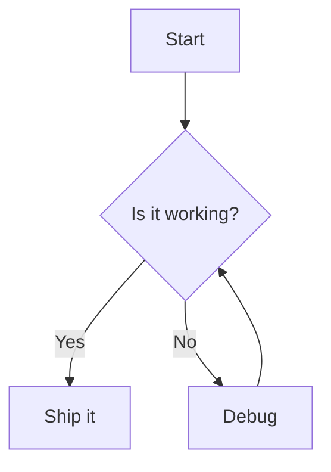
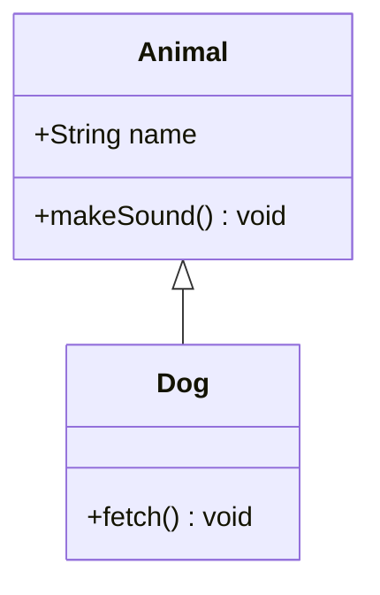
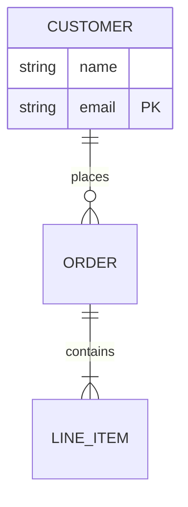
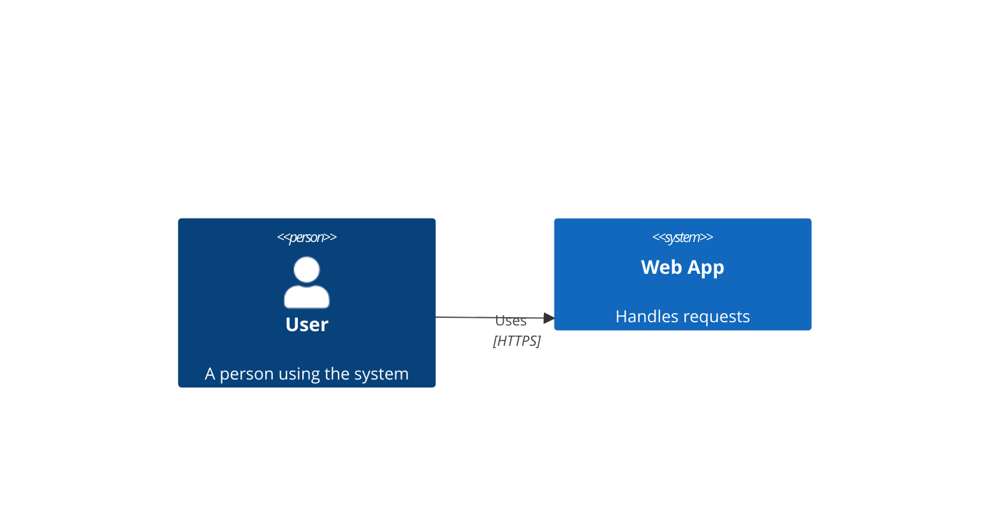

# Trellis — Mermaid Preview for VS Code

> **High-quality Mermaid diagram preview powered by a VLSI-grade orthogonal router — rendered entirely in-process via WebAssembly.**

---

## Features

### Live preview with instant updates
Open any `.mmd` or `.mermaid` file and press **Ctrl+Shift+V** (macOS: **⌘⇧V**) to open the preview panel to the side.
The diagram re-renders automatically as you type.

### VLSI-grade orthogonal edge routing
Trellis uses a multi-layer grid router inspired by VLSI channel-routing techniques.
Edges are routed on a Manhattan grid, with each wire assigned its own track to eliminate crossings where possible.
The result is clean, readable diagrams even for dense graphs.

### Fully self-contained — no server, no network
The renderer is compiled to WebAssembly and runs directly inside the VS Code webview sandbox.
No external process, no localhost server, no internet connection required.

### Supported diagram types

| Type | Syntax keyword |
|---|---|
| Flowchart | `flowchart LR / TD / …` |
| Class diagram | `classDiagram` |
| Entity-relationship diagram | `erDiagram` |
| C4 architecture | `C4Context`, `C4Container`, `C4Component`, `C4Dynamic`, `C4Deployment` |

---

## Usage

### Open a preview

| Action | How |
|---|---|
| Preview to the side | **Ctrl+Shift+V** / **⌘⇧V** |
| Preview in current column | Right-click editor → *Trellis: Open Preview* |
| Preview via command palette | **Ctrl+Shift+P** → *Trellis: Open Preview to the Side* |

### Status bar metrics

While the preview is open the panel title shows live render metrics:

```
Trellis Preview (12n 9e 4ms)
               ──┬──────────
                 └─ nodes · edges · render time
```

---

## Configuration

All settings are under the **Trellis** section in VS Code settings (`Ctrl+,`).

| Setting | Default | Description |
|---|---|---|
| `trellis.autoPreview` | `true` | Re-render the diagram automatically whenever the source file changes. |
| `trellis.cellSize` | `10` | Grid cell size in pixels used by the routing algorithm. Smaller values increase routing precision at the cost of performance. |
| `trellis.showEdgeLabels` | `true` | Display edge labels in the preview. |

---

## Example diagrams

### Flowchart



### Class diagram



### ER diagram



### C4 architecture



---

## Requirements

- VS Code **1.85** or later
- No additional runtime dependencies — the WASM renderer is bundled inside the extension

---

## Known limitations

- PNG/SVG export is planned for a future release
- Sequence diagrams, Gantt charts, pie charts, and Git graphs are not yet supported

---

## Release notes

### 0.1.0

- Initial release
- Live preview for flowchart, class, ER, and C4 diagrams
- VLSI-grade orthogonal edge routing via WebAssembly
- Configurable grid cell size, auto-preview, and edge-label display
- Keyboard shortcut: **Ctrl+Shift+V** / **⌘⇧V**

---

## Feedback and contributions

Found a bug or have a feature request?
Please open an issue at [github.com/trellis/trellis](https://github.com/trellis/trellis).

---

## License

See [LICENSE](LICENSE) in the repository root.
