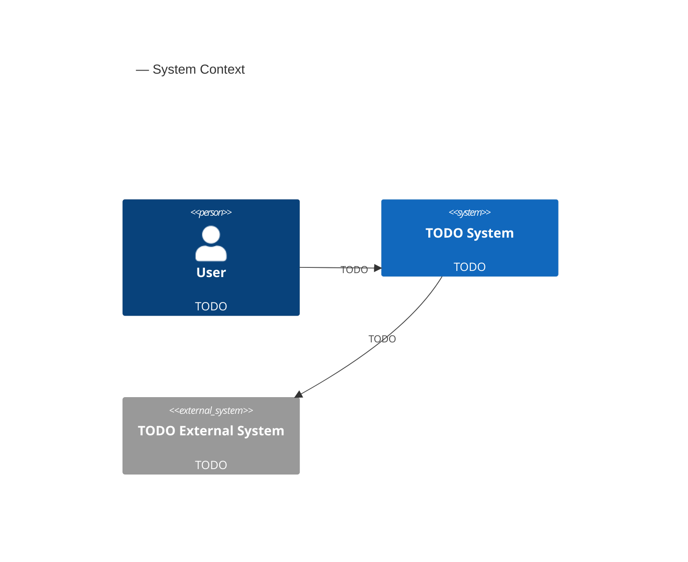

# Expectations — <project name>

> Produced by `ta:refine-expectations`. See `../conventions.md` for diagram and
> id rules.

## Business goals

<what success looks like for the business, in the sponsor's own terms>

## Users and stakeholders

| Role | Description | Primary goal |
|---|---|---|
| | | |

## Scope

### In scope

-

### Out of scope

-

## Constraints

| Type | Constraint | Source |
|---|---|---|
| Technical | | |
| Budget | | |
| Timeline | | |
| Compliance | | |

## Existing systems

<systems this design must integrate with, replace, or coexist with>

## Quality expectations

<qualities the user cares about in their own words — precise NFR wording comes
later in `02-requirements.md`>

## Success criteria

<how the user will know the delivered system succeeded>

## System context

**Figure fig-01.** System context — confirms scope boundary.

## Known facts

-

## Assumptions

<assumptions made where the user hasn't confirmed a fact yet — resolve or
carry forward explicitly, don't let them silently become facts>

-

## Open questions

-

## Raw notes

> Verbatim interview record, appended as the interview happens, in order asked.

**Q:** <question>
**A:** <answer, verbatim>
